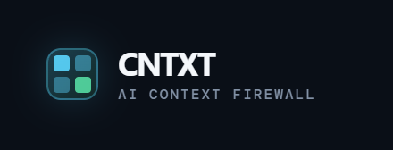
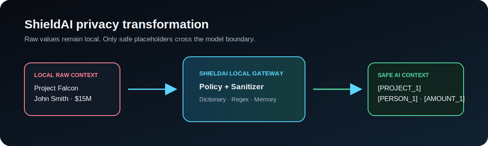
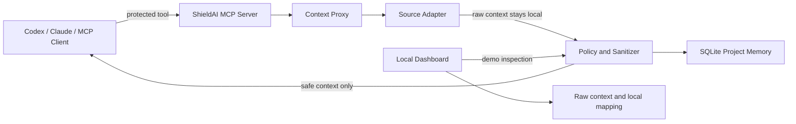

# ShieldAI / CNTXT

<p align="center">
  
</p>

**The local privacy layer between enterprise context and AI agents.**

ShieldAI is a runnable MCP privacy-gateway MVP. It retrieves context from a
connector, applies the company's policy locally, replaces sensitive values with
deterministic placeholders, and returns only the safe context to an AI client.

```text
Project Falcon is delayed at North Ridge Test Facility.
                  ↓
[PROJECT_1] is delayed at [LOCATION_1].
```

For the detailed Hebrew
project page, see [docs/PROJECT_OVERVIEW.md](docs/PROJECT_OVERVIEW.md). For a
presentation flow, see [docs/DEMO_SCRIPT.md](docs/DEMO_SCRIPT.md).

<<<<<<< HEAD
## Built at OpenAI Build Week — Tel Aviv

CNTXT was conceived and developed as a live, working MVP at the **OpenAI Build
Week Community Hackathon in Tel Aviv**. The project explores a practical
question that emerged from the event: how can an AI agent use enterprise
context without the model receiving the sensitive values inside it?

The team used **OpenAI Codex** as a development partner while turning the idea
into a running prototype: iterating on the gateway architecture, local
sanitization flow, interface, tests, and documentation. This acknowledgment
does not imply an endorsement or affiliation by OpenAI.

- [Pitch deck (PDF)](docs/Cntxt-Pitch-Deck.pdf)
- [Hackathon story and acknowledgments](docs/HACKATHON_CREDITS.md)
- [Detailed project overview (Hebrew)](docs/PROJECT_OVERVIEW.md)
=======
## Team credits

Built by the ShieldAI / CNTXT team:

| Team member | LinkedIn |
| --- | --- |
| Liav Samiya | [linkedin.com/in/liav-samiya](https://www.linkedin.com/in/liav-samiya/) |
| Naveh Talor | [linkedin.com/in/naveh-talor-a2636810a](https://www.linkedin.com/in/naveh-talor-a2636810a/) |
| Daniel Armoni | [linkedin.com/in/daniel-armoni](https://www.linkedin.com/in/daniel-armoni/) |
| Gal Shitrit | [linkedin.com/in/gal-shitrit-](https://www.linkedin.com/in/gal-shitrit-/) |
>>>>>>> 0093a0759e709567e679b5c9bcc65f5c7d6634b5

## What works today

| Capability | Status |
| --- | --- |
| Local policy, dictionary, regex and checksum detection | Working |
| Typed deterministic placeholders | Working |
| Per-project placeholder continuity in SQLite | Working |
| stdio MCP server | Working |
| Local HTTP JSON-RPC MCP endpoint | Working for the MVP |
| Dark-mode policy/dashboard UI | Working |
| Local audit metadata without raw context | Working |
| Local file upload → Markdown → sanitization | Working after MarkItDown installation |
| Slack and GitHub source adapters | Demo data only |
| Google Drive adapter | Optional real, read-only OAuth |
| External LLM response | Not implemented; dashboard response is local demo text |
| SSO, RBAC, approvals, generic upstream MCP proxy | Planned |

The dashboard explicitly labels demo sources as `Demo data`. It should not be
presented as a live Slack or GitHub integration.

## Architecture

### Visual privacy flow





The central invariant is:

1. The connector result stays inside ShieldAI.
2. Local detection identifies protected values.
3. A value becomes a typed placeholder such as `[PERSON_1]`.
4. The original-value mapping stays locally in the gateway.
5. Standard MCP results contain only `safe_context`.

### Deterministic placeholders

```text
Acme Defense hired John Smith for Project Falcon.
John Smith now leads Project Falcon.

[COMPANY_1] hired [PERSON_1] for [PROJECT_1].
[PERSON_1] now leads [PROJECT_1].
```

Within a request, and across requests having the same `project_id`, a protected
entity retains its placeholder. Rehydration is allowed only in the local demo
UI; it must never be sent back to an external model.

## Quick start on Windows

Requirements: Python 3.10+ and the local MarkItDown converters.

```powershell
cd C:\path\to\shieldai
python -m pip install -r requirements.txt
python backend\app.py
```

If Conda Python is not on your `PATH`:

```powershell
& "C:\Users\liavs\anaconda3\python.exe" backend\app.py
```

For Conda, install the same local dependency once:

```powershell
& "C:\Users\liavs\anaconda3\python.exe" -m pip install -r requirements.txt
```

Open [http://127.0.0.1:8787](http://127.0.0.1:8787). Frontend files are served
directly from `frontend/`, so refresh after CSS or JavaScript edits; restart
`backend/app.py` after backend edits.

## Run as an MCP server

### stdio transport

```powershell
cd C:\path\to\shieldai
python backend\mcp_server.py
```

Configure a local MCP client to launch that command. It exposes these protected
tools:

| Tool | Purpose |
| --- | --- |
| `shieldai_search_slack_messages` | Search protected Slack-like context |
| `shieldai_get_channel_history` | Read protected channel history |
| `shieldai_search_documents` | Search protected Drive-like documents |
| `shieldai_search_github` | Search protected repository data |

An MCP tool call returns safe text and metadata only:

```json
{
  "content": [{"type": "text", "text": "[PROJECT_1] is delayed..."}],
  "structuredContent": {"decision": "REDACT", "entitiesHidden": 8}
}
```

### Local HTTP transport

In a separate terminal:

```powershell
cd C:\path\to\shieldai
python backend\mcp_http.py
```

- Health: `http://127.0.0.1:8765/health`
- MCP endpoint: `http://127.0.0.1:8765/mcp`

This endpoint is a compact local JSON-RPC implementation for the MVP. A
production deployment needs full Streamable HTTP support, session handling,
Origin validation and authentication.

## Dashboard API

| Endpoint | Method | Purpose |
| --- | --- | --- |
| `/api/overview` | `GET` | Aggregate audit metrics and endpoint status |
| `/api/connectors` | `GET` | Connector status and tools |
| `/api/policy` | `GET`, `POST` | Read or update policy |
| `/api/protect` | `POST` | Full demo retrieve → sanitize → audit flow |
| `/api/documents/protect` | `POST` | Local file → Markdown → sanitize flow |
| `/api/memory?project_id=...` | `GET` | Local placeholder continuity |
| `/api/logs` | `GET` | Recent audit metadata |
| `/api/connectors/google-drive/authorize` | `POST` | Start local Drive OAuth |

`/api/protect` returns raw context and the mapping to the local dashboard for
visual explanation. It has no authentication; keep it localhost-only and do
not reuse it as a production API.

## Policy and local detection

Policies live in `data/policy.json`. The dashboard can enable/disable category
protection and update a custom dictionary.

Built-in policy categories:

- project names and employee names
- budget, amounts and Luhn-valid credit-card numbers
- API keys, JWTs and tokens
- locations and GPS coordinates
- databases, servers and internal systems
- companies, customers, email addresses and phone numbers

Detection order is custom dictionary, regex patterns, Luhn validation and then
placeholder-memory reuse. No source content is sent externally for detection.

## Connect a real Google Drive

Google Drive is the one optional live source adapter. It uses local desktop
OAuth and the read-only scope `https://www.googleapis.com/auth/drive.readonly`.

1. Enable **Google Drive API** in Google Cloud Console.
2. Create a **Desktop app** OAuth client.
3. Save its downloaded JSON as `secrets/google-oauth-client.json`.
4. Restart the dashboard and select **Connect Google Drive**.
5. Approve Google's read-only consent screen.

The OAuth client JSON and token are ignored by Git:

```text
secrets/
data/google_token.json
```

Google Docs and text, Markdown, JSON, CSV and HTML files are read locally
before sanitization. PDFs and Office documents downloaded from Drive use the
same local MarkItDown converter as uploads. See the precise
[Google Drive setup guide](docs/GOOGLE_DRIVE_SETUP.md).

## Local document conversion

The dashboard's **Live firewall** view accepts PDF, DOCX, PPTX, XLSX, XLS,
TXT, Markdown, CSV and JSON files up to 10 MB. MarkItDown converts the file to
Markdown locally; CNTXT then sends that extracted text through the same policy,
placeholder and audit path as MCP connector context. The original file is held
only in an ephemeral local staging directory during conversion and is not
recorded in the audit log.

This image installs a deliberately small subset of
[Microsoft MarkItDown](https://github.com/microsoft/markitdown): PDF, Word,
PowerPoint and Excel converters. Plugins, OCR and LLM-based image descriptions
are disabled, so conversion itself does not use an external AI service.

Never paste OAuth JSON, tokens or client secrets into chat or commit them.

## Docker — isolated local services

ShieldAI uses its own Docker Compose project, containers, network and volume:

```text
Containers: shieldai-dashboard, shieldai-mcp
Network:    shieldai_net
Volume:     shieldai_data
```

```powershell
cd C:\path\to\shieldai
docker compose up --build -d
docker compose ps
```

| Service | Local address |
| --- | --- |
| Dashboard | `http://127.0.0.1:18787` |
| MCP HTTP | `http://127.0.0.1:18765/mcp` |

Both ports bind to `127.0.0.1` only. To stop the local ShieldAI stack:

```powershell
docker compose down
```

## Optional Electron desktop shell

```powershell
cd C:\path\to\shieldai\desktop
npm install
$env:SHIELDAI_PYTHON = "C:\Path\To\python.exe"
npm start
```

See [desktop/README.md](desktop/README.md) for Windows details.

## Tests

```powershell
cd C:\path\to\shieldai
python -m unittest discover -s tests -v
```

Tests cover deterministic repeated entities, card validation, API-key removal,
policy enable/disable behavior, safe MCP output, mapping omission, project
continuity and proxy routing.

## Project structure

```text
backend/
  app.py              Dashboard API and static-file server
  gateway.py          Retrieve → sanitize → remember → audit flow
  context_proxy.py    Routes tools to source adapters
  sanitizer.py        Local detectors and placeholder mapper
  policies.py         Editable policy model
  project_memory.py   SQLite placeholder continuity
  mcp_server.py       stdio MCP server
  mcp_http.py         Local HTTP MCP endpoint
  google_drive.py     Optional read-only Drive OAuth adapter
  document_converter.py  Constrained local MarkItDown conversion
  connectors.py       Local Slack, Drive and GitHub demo datasets
frontend/             Dependency-free dark-mode dashboard
desktop/              Optional Electron shell
docs/                 Project and demo documentation
fake_company_data/    Safe mock connector data
data/                 Runtime policy, audit and local memory
tests/                Automated tests
```

## Security boundaries and limitations

ShieldAI currently protects raw data returned through its own path. It does not
protect a user who connects an AI client directly to another MCP server or
pastes secrets directly into a third-party chat.

- Slack and GitHub are demo adapters today.
- There is no SSO, RBAC, tenant isolation or approval flow yet.
- The dashboard is intentionally local and unauthenticated.
- The local SQLite mapping and Drive token are not encrypted at rest in this
  MVP; production requires OS keychain/KMS encryption and a secrets vault.
- Regex and dictionaries cannot identify every contextual trade secret; a
  high-risk production policy should fail closed.
- Real Drive is a direct API adapter, not a generic proxied upstream MCP
  server.

## Roadmap

1. Generic upstream MCP client for stdio and Streamable HTTP.
2. SSO/OAuth, identity propagation, RBAC and per-connector scopes.
3. Real Slack and GitHub connectors.
4. Encryption for memory and OAuth tokens.
5. Optional local OCR for scanned documents, behind an explicit policy.
6. Streaming, approvals, policy versioning, SIEM exports and compliance reports.

For the architecture story, exact current-state assessment and presentation
positioning, read [docs/PROJECT_OVERVIEW.md](docs/PROJECT_OVERVIEW.md).

<<<<<<< HEAD
## Team credits

Built by the ShieldAI / CNTXT team:

| Team member | LinkedIn |
| --- | --- |
| Liav Samiya | [linkedin.com/in/liav-samiya](https://www.linkedin.com/in/liav-samiya/) |
| Daniel Armoni | [linkedin.com/in/daniel-armoni](https://www.linkedin.com/in/daniel-armoni/) |
| Gal Shitrit | [linkedin.com/in/gal-shitrit-](https://www.linkedin.com/in/gal-shitrit-/) |
| Naveh Talor | [linkedin.com/in/naveh-talor-a2636810a](https://www.linkedin.com/in/naveh-talor-a2636810a/) |

## Hackathon acknowledgments

Built during the OpenAI Build Week Community Hackathon in Tel Aviv, with
gratitude to **OpenAI Build Week**, **OpenAI Codex**, organizers
[Vlad Tansky](https://www.linkedin.com/in/vlad-tansky/) and
[Eliezer Steinbock](https://www.linkedin.com/in/elie222/), and hosts **Echo**
and **Xsolla**. See [the full attribution and project origin](docs/HACKATHON_CREDITS.md).

=======
>>>>>>> 0093a0759e709567e679b5c9bcc65f5c7d6634b5
## License

This project is distributed under the [BSD 3-Clause License](LICENSE).
