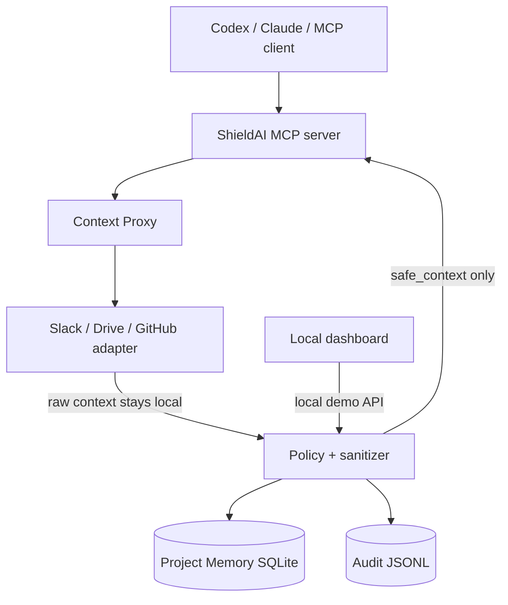

# ShieldAI / CNTXT — דף פרויקט מפורט


> **המשפט שמסכם את המוצר:** ShieldAI היא שכבת פרטיות מקומית בין מידע
> ארגוני לבין סוכני AI. היא מחליפה מידע רגיש ב־placeholders עקביים לפני
> שההקשר יוצא אל המודל.

מסמך זה מתאר את מה שנבנה בפועל בפרויקט, את גבולות ה־MVP ואת הדרך להפוך אותו
למוצר ארגוני מלא. הוא משלים את [README](../README.md), שמכיל הוראות הפעלה
טכניות.

## 1. הבעיה

עובדים רוצים להשתמש ב־Codex, ChatGPT, Claude וסוכני AI אחרים מול Slack,
Google Drive, GitHub ומערכות ארגוניות. המידע שמוחזר מהמערכות האלה יכול לכלול:

- שמות עובדים ולקוחות
- שמות פרויקטים, מוצרים וסודות מסחריים
- סכומים, מספרי כרטיסים ומידע פיננסי
- מפתחות API, JWTs, כתובות שרת ומסדי נתונים
- מיקומים, מסמכים פנימיים ומידע רגולטורי

אם המודל מקבל את הערכים המקוריים, הארגון מאבד שליטה על המידע שנשלח לספק
המודל. מחיקה מוחלטת של הטקסט אינה פתרון טוב: היא שוברת הקשרים ומקטינה את
איכות התשובה.

## 2. הפתרון שבנינו

במקום:

```text
AI client → Slack / Drive / GitHub → מודל חיצוני
```

ShieldAI מכניסה שכבת אכיפה:

```text
AI client → ShieldAI MCP Gateway → connector → ShieldAI sanitizer → AI client
```

דוגמה:

```text
מקור:
Acme Defense signed a $15M contract with Lockheed for Project Falcon.

מה שהמודל מקבל:
[COMPANY_1] signed an [AMOUNT_1] contract with [COMPANY_2] for [PROJECT_1].
```

המודל עדיין מבין שיש שתי חברות, חוזה, סכום ופרויקט; אך הוא אינו רואה את
הערכים המקוריים.

## 3. הארכיטקטורה הנוכחית



### סדר הפעולות בכל בקשה

1. לקוח MCP מפעיל כלי של ShieldAI, למשל
   `shieldai_search_slack_messages`.
2. `ContextProxyEngine` ממפה את הכלי למקור ולפעולה המתאימים.
3. ה־adapter מחזיר מידע גולמי אל ה־gateway בלבד.
4. `Sanitizer` קורא את המדיניות הפעילה ואת המיפויים הקודמים של הפרויקט.
5. הוא מזהה ערכים רגישים, יוצר או ממחזר placeholder, ומחליף את הערכים בטקסט.
6. `ProjectMemoryStore` שומר את המיפוי מקומית עבור אותו `project_id`.
7. `ShieldAIGateway` יוצר audit event ללא תוכן מקור.
8. ה־MCP client מקבל רק את `safe_context`.

## 4. מה מונע דליפת מידע

העיקרון הקריטי הוא הפרדת המידע:

| רכיב | רשאי לראות מידע מקור? | מה יוצא ממנו? |
| --- | --- | --- |
| Connector adapter | כן | הקשר גולמי ל־gateway בלבד |
| Sanitizer | כן | טקסט מוחלף ב־placeholders |
| Project memory | כן, מקומית | מיפוי עקביות בלבד |
| Audit log | לא | metadata בלבד |
| MCP client / מודל | לא | `safe_context` בלבד |
| Dashboard מקומי | כן, לצורך הדגמה | מידע מקומי בלבד |

ה־dashboard הוא חריג מכוון עבור ההדגמה: הוא מציג מקור, מיפוי ותשובה שעברה
rehydration כדי שאפשר יהיה לראות את הערך. הוא אינו API מאומת ולכן חייב להישאר
על `localhost` בלבד.

## 5. מנוע הסינון

הסינון הוא אלגוריתמי ומקומי — אין קריאה לבינה מלאכותית חיצונית.

### שכבות הזיהוי שקיימות היום

1. **מילון ארגוני מותאם אישית** — לדוגמה `Project Falcon`, `Acme Defense`,
   `Orion Database`. כל מונח מקבל סוג כגון `PROJECT` או `DATABASE`.
2. **Regex** — email, מספר טלפון, IPv4, JWT, API key, סכום כספי ו־GPS.
3. **בדיקת Luhn** — רק מספר אשראי תקין הופך ל־`[CREDIT_CARD_n]`.
4. **זיכרון פרויקט** — אותו ערך באותו פרויקט יקבל אותו placeholder גם בבקשה
   מאוחרת יותר.

### קטגוריות המדיניות בממשק

- Project Names
- Employee Names
- Budget / Money
- API Keys / Tokens
- Locations / GPS
- Databases / Servers
- Customers / Companies
- Email / Phone

המשתמש צריך רק לסמן מה אסור למודל לראות, ולהוסיף מילים רגישות למילון. אין צורך
לכתוב regex עבור המקרים הרגילים.

## 6. Placeholder mapping ו־rehydration

המיפוי הוא דטרמיניסטי לפי זוג של `entity_type` וערך canonicalized:

```text
Project Falcon → [PROJECT_1]
John Smith     → [PERSON_1]
Project Falcon → [PROJECT_1]
```

המיפוי נשמר ב־`data/project_memory.db` תחת `project_id`. כך אפשר לבקש סיכום
מסמך ולאחר מכן לשאול עליו שאלת המשך בלי שהמודל יצטרך לקבל את השם המקורי.

בסיום, ממשק ShieldAI יכול להחליף בחזרה placeholders שהופיעו בתשובת המודל. הוא
מחליף רק placeholders שנוצרו באותה בקשה, ולא שולח את המילון למודל.

## 7. ה־MCP בפרויקט

MCP הוא הפרוטוקול שמאפשר ל־AI client לגלות ולהפעיל כלים. ShieldAI חושפת כלים
משלה ולא את כלי המקור ישירות:

```text
shieldai_search_slack_messages
shieldai_get_channel_history
shieldai_search_documents
shieldai_search_github
```

יש שני מצבי הפעלה:

| מצב | קובץ | שימוש |
| --- | --- | --- |
| stdio | `backend/mcp_server.py` | חיבור מקומי של לקוח שמפעיל subprocess |
| HTTP מקומי | `backend/mcp_http.py` | endpoint ב־`127.0.0.1:8765/mcp` |

ב־stdio התוצאה של `tools/call` כוללת טקסט מוגן בלבד. ה־HTTP endpoint הנוכחי
הוא JSON-RPC מקומי לצורך ה־MVP; הוא עדיין אינו יישום מלא של Streamable HTTP,
OAuth ו־session management של MCP.

## 8. חיבורי מידע: מה אמיתי ומה דמו

| מקור | מצב | פירוט |
| --- | --- | --- |
| Slack | דמו | הנתונים מגיעים מ־`fake_company_data/slack_messages.json` |
| GitHub | דמו | הנתונים מגיעים מ־`fake_company_data/github_data.json` |
| Drive | דמו כברירת מחדל | הנתונים מגיעים מ־`fake_company_data/documents.json` |
| Google Drive | אמיתי אופציונלי | OAuth מקומי לקריאה בלבד; מופעל רק לאחר אישור המשתמש |
| GPT / Claude / Gemini | לא מחובר | תשובת המודל בדשבורד היא local demo response |

החיבור ל־Google Drive הוא adapter ישיר ל־Drive API, לא ל־Google Drive MCP
חיצוני. הוא קורא Google Docs וקבצים טקסטואליים מקומית ואז מעביר אותם דרך
הסניטייזר.

## 9. ממשק המשתמש

נבנה dashboard כהה, מקומי וללא תלות ב־frontend framework. הוא כולל:

- **Overview** — מצב gateway, סטטיסטיקות ו־audit activity.
- **MCP Connections** — מצב החיבורים והגבול בין client, gateway ו־connectors.
- **Live Firewall** — השוואה בין raw context לבין safe context.
- **Project Memory** — המיפויים המקומיים של הפרויקט.
- **Policies** — templates ענפיים, toggles ומילון מותאם אישית.

בדף Live Firewall מוצג במפורש איזה צד נשאר מקומי ואיזה צד מותר לשלוח למודל.
זו הנקודה החזקה ביותר בהדגמה: השופטים רואים בעיניים שהשימושיות נשמרת בלי לחשוף
את הערך הרגיש.

## 10. הפעלה ופריסה

### מקומית

```powershell
& "C:\Users\liavs\anaconda3\python.exe" backend\app.py
& "C:\Users\liavs\anaconda3\python.exe" backend\mcp_http.py
```

ה־dashboard נמצא על `127.0.0.1:8787`; ה־MCP HTTP על `127.0.0.1:8765`.

### Docker

Docker Compose מגדיר שני containers ייעודיים ל־ShieldAI:

```text
shieldai-dashboard  → 127.0.0.1:18787
shieldai-mcp        → 127.0.0.1:18765
```

ל־stack יש network ו־volume נפרדים: `shieldai_net` ו־`shieldai_data`.

### Electron

התיקייה `desktop/` מכילה shell אופציונלי שמפעיל את שני השירותים המקומיים ופותח
את הממשק.

## 11. בדיקות שבוצעו

מערך `tests/test_gateway.py` בודק:

- עקביות של entity חוזר.
- זיהוי מספר אשראי רק כאשר Luhn תקין.
- הסתרת API key מה־safe context.
- כיבוי קטגוריית policy.
- החזרת תוצאה מוגנת מה־gateway ללא auth.
- החזרת mapping רק בנתיב הדמו המקומי.
- המשכיות placeholders בין שני gateway instances.
- ניתוב כלי Slack דרך ה־Context Proxy.

בנוסף נבדקו ידנית ה־dashboard, ה־MCP stdio, ה־API המקומי, תחביר JavaScript
והגדרת Docker Compose.

## 12. מגבלות ידועות — חשוב להציג בכנות

1. אין עדיין SSO, RBAC, משתמשים או הרשאות מקור per-user.
2. Slack ו־GitHub אינם מחוברים לחשבונות אמיתיים.
3. אין עדיין GenericMCPConnector שמתחבר לכל MCP חיצוני באמצעות stdio או
   Streamable HTTP.
4. הקובץ `project_memory.db` וה־Google token המקומי אינם מוצפנים at rest.
5. Regex ומילון אינם יכולים לזהות כל סוד עסקי המנוסח בעקיפין.
6. אם משתמש מחבר את Codex ישירות ל־MCP חיצוני, הוא עוקף את ShieldAI.
7. אין שיחה אמיתית עם provider של LLM; ה־rehydrated response במסך הוא הדגמה.

## 13. הדרך למוצר ארגוני

```text
AI client
   ↓ OAuth / SSO identity
ShieldAI MCP server
   ↓ authorization + policy + sanitizer
Generic upstream MCP client
   ↓ per-user OAuth token
Slack / GitHub / Drive / internal MCP servers
```

אבני הדרך המומלצות:

1. לבנות `GenericMCPConnector` עם תמיכה ב־stdio וב־Streamable HTTP.
2. ליישם OAuth/SSO ו־RBAC כדי שה־gateway יבדוק גם *מי* מבקש מידע, לא רק *מה*
   המודל רשאי לראות.
3. לשמור tokens ומיפויים ב־vault מוצפן או OS keychain.
4. להוסיף connectors אמיתיים ל־Slack ול־GitHub.
5. להוסיף MarkItDown מקומי להמרת PDF, DOCX, XLSX, PPTX ותמונות ל־text/Markdown.
6. להוסיף approval flow, versioned policies, SIEM export ודוחות compliance.

## 14. מיצוב מול מוצרים כמו Willow

Willow היא control plane ארגונית רחבה: זהויות, הרשאות, connectors, discovery
ואכיפה. ShieldAI ממוקדת בנקודת פרטיות אחרת:

> **לא רק מי רשאי להפעיל כלי — אלא איזה ערכים המודל עצמו רשאי לראות.**

הבידול הוא החלפה דטרמיניסטית ששומרת הקשר ומאפשרת reasoning על מידע ארגוני בלי
לשלוח את הערכים המקוריים למודל. בטווח ארוך ShieldAI יכולה להיות שכבת privacy
transformation משלימה ל־MCP gateway ארגוני גדול יותר.

## 15. משפט סיום לדמו

> **“ShieldAI does not ask an enterprise to trust every AI connector. It makes
> privacy transformation the only path between internal context and the model.”**
